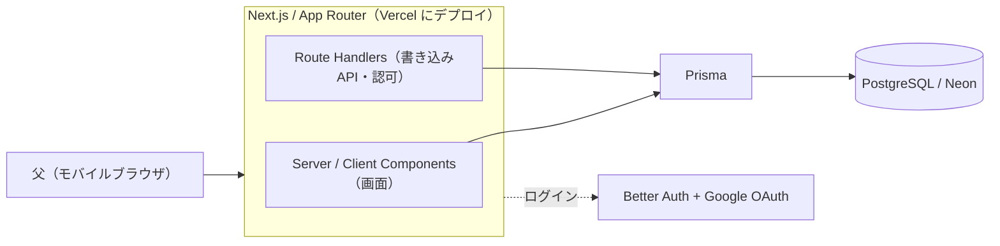

# MyCellar 🥃

> 父のウイスキーコレクションを管理する、自分専用の在庫・カタログ Web アプリ。
> 産地・年数・樽・限定版まで含めて所有ボトルを記録し、コレクションの全体像や傾向を眺めて楽しめる。

<!-- TODO（実装後）: デモURL / スクリーンショット / デモGIF を貼る -->

**デモ**：（実装後に追記）

---

## 概要

- **誰のための何か**：ウイスキーを多数所有する父（非エンジニア・スマホ中心）のための、個人コレクション管理アプリ。
- **解く課題**：コレクションの全体像や傾向を眺めて楽しみたい。
- **特徴**：銘柄だけでなく、産地・年数・樽・限定版・本数まで記録でき、傾向をグラフで可視化。

## 主な機能（MVP）

- Google ログイン（ユーザーごとにデータを分離）
- ボトルの登録・一覧・詳細・編集・削除（必須は銘柄名のみ、他は任意）
- 国・地域 / 年数（NAS 可）/ 樽 / 限定版 / 本数 / メモ の記録
- コレクションの傾向を簡単なグラフで可視化（国別の本数 など）

> 次点：写真アップロード・テイスティング記録・AI「今夜の1杯」提案（詳細は `docs/roadmap.md`）

## アーキテクチャ



1 リポジトリ・1 デプロイ（Vercel）で完結。読み取りは Server Component が Prisma を直接呼び、書き込みは Route Handler が認可・バリデーション・DB アクセスを担う。

## 技術選定

> 「重い分岐があった決定」は ADR（`docs/adr.md`）に記録。下表は各スタックの一言理由。

| 技術                         | 役割          | 選んだ理由（一言）                                                                             |
| ---------------------------- | ------------- | ---------------------------------------------------------------------------------------------- |
| Next.js（App Router）        | フロント＋API | フロントと API を 1 つに閉じられる主スタック。現行標準（→ ADR-0002 / ADR-0008）                |
| TypeScript                   | 言語          | 型安全で、フォーム〜API〜DB を一貫した型で繋ぐ                                                 |
| Route Handlers               | バックエンド  | 書き込みAPIを自分で実装。読みは Server Component 直読み（→ ADR-0002）                          |
| Prisma                       | ORM           | スキーマ駆動で型安全・マイグレーションが一貫（→ ADR-0007）                                     |
| PostgreSQL（Neon）           | DB            | 定番のリレーショナル DB。サーバーレスで無料枠あり                                              |
| Better Auth（Google）        | 認証          | パスワードを保持せず安全。父も使える。auth.js のメンテナンスモード化を受け再選定（→ ADR-0010） |
| Tailwind CSS                 | スタイル      | モバイルファーストを高速に書ける                                                               |
| shadcn/ui                    | UI 部品       | アクセシブルな部品を「自分のコード」として持てる                                               |
| react-hook-form ＋ zod       | フォーム/検証 | フォーム管理と型安全なバリデーション                                                           |
| Recharts                     | 可視化        | React と相性が良く、傾向グラフを手早く                                                         |
| Vercel                       | デプロイ      | Next.js に最適。push で前後まとめてデプロイ                                                    |
| ESLint ＋ Prettier           | 規約          | コーディング規約をツールで強制（文書化しない）                                                 |
| Playwright ＋ GitHub Actions | テスト/CI     | 主要フローの E2E と継続的インテグレーション                                                    |
| UploadThing / Vercel Blob    | 画像（次点）  | 写真保存をマネージドで軽く（→ ADR-0005）                                                       |

## ドキュメント

| ファイル               | 内容                                    |
| ---------------------- | --------------------------------------- |
| `docs/requirements.md` | 要件概要（目的・スコープ・方針）        |
| `docs/user-stories.md` | ユーザーストーリー＋受け入れ条件        |
| `docs/data-model.md`   | データモデル（ER・Prisma スキーマ下地） |
| `docs/roadmap.md`      | ロードマップ＋マイルストーン            |
| `docs/adr.md`          | 意思決定記録（なぜその選択をしたか）    |
| `CONTRIBUTING.md`      | 開発フロー・コードスタイル・PR          |

## セットアップ

<!-- TODO（#2 実装後）: Prisma 導入後に `pnpm prisma migrate dev` の検証結果を反映する -->

```bash
# 1. 依存をインストール
pnpm install

# 2. 環境変数（DB）：Vercel の Neon 統合から取得
#    DATABASE_URL（pooled）・DATABASE_URL_UNPOOLED（direct）などが .env に入る
pnpm dlx vercel link
pnpm dlx vercel env pull .env

# 3. 環境変数（認証）：Better Auth 系を .env に手動で追記 ※ 雛形は .env.example を参照
#    GOOGLE_CLIENT_ID / GOOGLE_CLIENT_SECRET / BETTER_AUTH_SECRET / BETTER_AUTH_URL

# 4. DB マイグレーション
pnpm prisma migrate dev

# 5. 開発サーバ起動
pnpm dev
```

> **Google OAuth のリダイレクト URI 登録**（`.env` だけでは不足）：Google Cloud Console の OAuth クライアントで「承認済みのリダイレクト URI」に以下を登録する。未登録だとログインが `redirect_uri_mismatch` で失敗する。
>
> - ローカル：`http://localhost:3000/api/auth/callback/google`
> - 本番：`{BETTER_AUTH_URL}/api/auth/callback/google`（例：`https://<本番ドメイン>/api/auth/callback/google`）

## ステータス

開発中（MVP）。進捗は GitHub Issues / Projects を参照。

<!-- TODO（実装後）: ライセンス / 作者リンク など -->
