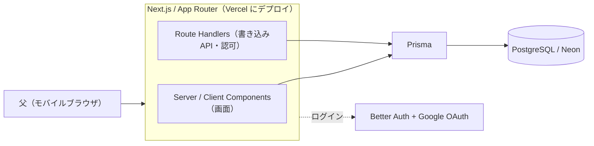

# MyCellar 🥃

> 自分専用のウイスキー在庫を管理・コレクションするためのアプリケーション。
> 産地・年数・樽・限定版まで含めて所有ボトルを記録し、コレクションの全体像や傾向を眺めて楽しめる。

<!-- TODO（実装後）: デモURL / スクリーンショット / デモGIF を貼る -->

**デモ**：（実装後に追記）

---

## 概要

- **誰のための何か**：ウイスキーを多数所有する父（非エンジニア・スマホ中心）のための、個人コレクション管理アプリ。
- **解く課題**：コレクションの全体像や傾向を眺めて楽しみたい。
- **特徴**：銘柄だけでなく、産地・年数・樽・限定版・本数まで記録でき、傾向をグラフで可視化。

## 主な機能（MVP）

- Google ログイン（ユーザーごとにデータを分離）
- ボトルの登録・一覧・詳細・編集・削除（必須は銘柄名のみ、他は任意）
- 産地・地域 / 年数（NAS 可）/ 樽 / 限定版 / 本数 / メモ の記録
- コレクションの傾向を簡単なグラフで可視化（産地別の本数 など）

## アーキテクチャ


```mermaid
flowchart LR
    U["父（モバイルブラウザ）"] --> APP
    subgraph APP["Next.js / App Router（Vercel にデプロイ）"]
      UI["Server / Client Components（画面）"]
      API["Route Handlers（書き込みAPI・認可）"]
    end
    API --> P["Prisma"] --> DB[("PostgreSQL / Neon")]
    UI --> P
    APP -. ログイン .-> AUTH["Better Auth + Google OAuth"]
```

1 リポジトリ・1 デプロイ（Vercel）で完結。読み取りは Server Component が Prisma を直接呼び、書き込みは Route Handler が認可・バリデーション・DB アクセスを担う。

## 技術選定

> 「重い分岐があった決定」は ADR（`docs/adr.md`）に記録。下表は各スタックの一言理由。

| 技術                                | 役割          | 選んだ理由(選んだ理由が弱い)（一言）                                                                                                  |
| ----------------------------------- | ------------- | ------------------------------------------------------------------------------------------------------------------------------------- |
| Next.js（App Router）               | フロント＋API | 現状、フロントエンド領域で最も使用されているフレームワーク。フロントとAPIを1つに閉じられるのも魅力。現行標準（→ ADR-0002 / ADR-0008） |
| TypeScript                          | 言語          | 型安全で、フォーム〜API〜DB を一貫した型で繋ぐ                                                                                        |
| Route Handlers                      | バックエンド  | 書き込みAPIを自分で理解して実装できる点が魅力。読みは Server Component 直読み（→ ADR-0002）                                           |
| Prisma                              | ORM           | スキーマ駆動で型安全・マイグレーションが一貫しており、`schema.prisma`がそのまま正本となり宣言的なのもいい（→ ADR-0007）               |
| PostgreSQL（Neon）                  | DB            | 定番のリレーショナル DB。サーバーレスで無料枠あり                                                                                     |
| Better Auth 　　　　　　　　        | 認証          | auth.jsの非推奨化やメンテナンスモード化を受け再選定（→ ADR-0010）                                                                     |
| Google OAuth                        | 認証          | パスワードを保持せず安全！父でもGoogleアカウントを持っており、めんどくさがりな父が登録を一瞬で行える。（→ ADR-0010）                  |
| Tailwind CSS                        | スタイル      | モバイルファーストを高速に書ける                                                                                                      |
| shadcn/ui                           | UI 部品       | アクセシブルな部品を「自分のコード」として持てる                                                                                      |
| react-hook-form ＋ zod              | フォーム/検証 | フォーム管理と型安全なバリデーション                                                                                                  |
| Vercel                              | デプロイ      | 小規模なプロダクトに最適。手軽にデプロイでき、各PR毎に確認ができるpreview環境や環境毎に分けられるDBが魅力                             |
| ESLint ＋ Prettier                  | 規約          | コーディング規約をツールで強制                                                                                                        |
| Playwright/Vitest ＋ GitHub Actions | テスト/CI     | ?                                                                                                                                     |
| UploadThing / Vercel Blob           | 画像          | 写真保存をマネージドで軽く（→ ADR-0005）                                                                                              |

## ドキュメント

| ファイル               | 内容                                         |
| ---------------------- | -------------------------------------------- |
| `docs/requirements.md` | 要件概要（目的・スコープ・方針）             |
| `docs/data-model.md`   | データモデルに関するコンテクスト(メタデータ) |
| `docs/roadmap.md`      | ロードマップ＋マイルストーン                 |
| `docs/adr.md`          | 意思決定記録（なぜその選択をしたか）         |
| `CONTRIBUTING.md`      | 開発フロー・コードスタイル・PR               |

<!-- (ここはまだ雑い！) -->

## セットアップ

```bash
# 1. 依存をインストール
pnpm install

# 2. 環境変数：Vercel から取得（開発用の dev ブランチを指す値が入る）
#    書き出し先の .env は必ず指定する（省くと .env.local になり、Prisma CLI が読まない）
pnpm dlx vercel link
pnpm dlx vercel env pull .env

# 3. 環境変数（認証）：Better Auth 系を .env に手動で追記 ※ 雛形は .env.example を参照
#    GOOGLE_CLIENT_ID / GOOGLE_CLIENT_SECRET / BETTER_AUTH_SECRET / BETTER_AUTH_URL

# 4. DB マイグレーション
pnpm prisma migrate dev

# 5. 開発サーバ起動
pnpm dev
```

> **Google OAuth のリダイレクト URI 登録**（`.env` だけでは不足）：Google Cloud Console の OAuth クライアントで「承認済みのリダイレクト URI」に以下を登録する。未登録だとログインが `redirect_uri_mismatch` で失敗する。
>
> - ローカル：`http://localhost:3000/api/auth/callback/google`
> - 本番：`{BETTER_AUTH_URL}/api/auth/callback/google`（例：`https://<本番ドメイン>/api/auth/callback/google`）

## DB とマイグレーション

環境ごとに別の DB を見る（→ `docs/adr.md` ADR-0014）。

| 環境              | DB                                                   |
| ----------------- | ---------------------------------------------------- |
| ローカル・Preview | dev ブランチ                                         |
| 本番              | 本番ブランチ                                         |
| CI                | 持たない（`prisma generate` を通すためのダミーだけ） |

**開発**：`pnpm prisma migrate dev`。`.env` の値が dev ブランチを指すので、本番には届かない。

**本番**：`main` へマージ → 本番デプロイの完了を確認 → 手元から適用する。

```bash
DATABASE_URL_UNPOOLED='<本番の direct 接続文字列>' pnpm prisma migrate deploy
```

`dotenv` は既にある環境変数を上書きしないため、この指定で本番だけに向く。

> **暫定の手順**：自動化するかを含め、正式な手順は #98 で決める。
>
> **旧コードが壊れる形の変更（`NOT NULL` 追加など）は 2 つの PR に割る。**「NULL 許容で追加 → デプロイ → 制約を付ける」。#57 では本番のコードが旧版のままマイグレーションだけ先に入り、本番が 3 日間落ちた。

<!-- TODO（実装後）: ライセンス / 作者リンク など -->
