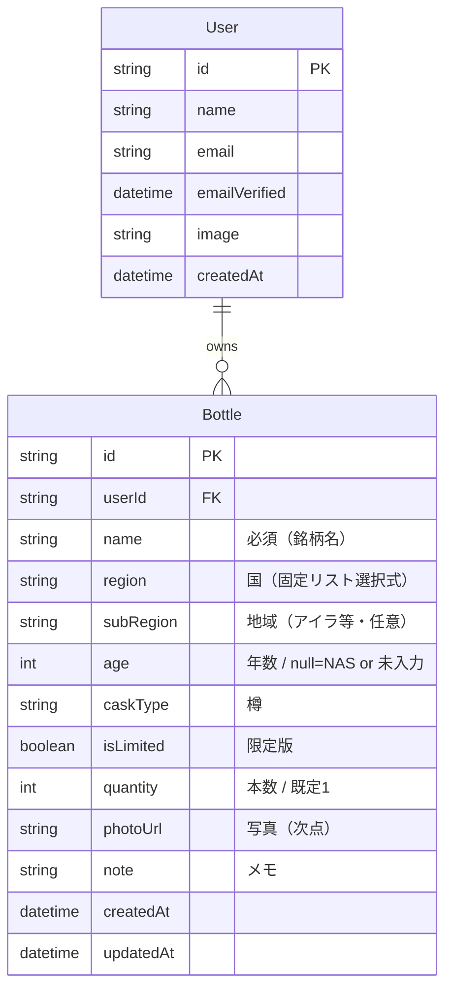

# MyCellar データモデル

> フラット構成（1 テーブル）。`User` 1 ─< `Bottle` の 1 対多。
> 個人利用・数百件規模のため正規化はしない（理由は末尾「設計判断」参照）。

---

## ER 図



## 項目仕様：User

> auth.js（Google 認証）が管理するため、これらは**自分で設計・実装しない**。
> Google ログイン時に名前・メール・画像 URL が渡され、アダプタが自動で保存する。
> **このモデル全体が Prisma アダプタの要求仕様に従う**。`emailVerified` のように自分では使わないフィールドも、アダプタが要求するため勝手に削らない。

| 項目          | 型        | 必須 | 備考                                                                        |
| ------------- | --------- | ---- | --------------------------------------------------------------------------- |
| id            | string    | ○    | 主キー                                                                      |
| name          | string?   | –    | Google から取得                                                             |
| email         | string?   | –    | Google から取得（一意）                                                     |
| emailVerified | datetime? | –    | **アダプタが要求するフィールド**（Google OAuth では実質未使用だが削らない） |
| image         | string?   | –    | **Google のプロフィール画像 URL**。文字列が入るだけで実装コストは無い       |
| createdAt     | datetime  | ○    | 作成日時                                                                    |

## 項目仕様：Bottle

| 項目                  | 型       | 入力必須  | 既定  | 備考                                                                                                      |
| --------------------- | -------- | --------- | ----- | --------------------------------------------------------------------------------------------------------- |
| id                    | string   | –（自動） | 自動  | 主キー                                                                                                    |
| userId                | string   | –（自動） | —     | 所有者（ログインユーザーから設定。User への FK）                                                          |
| name                  | string   | **○**     | —     | 銘柄名。**唯一の必須項目**                                                                                |
| region                | string?  | –         | —     | 国。**固定リスト選択式**（表記ゆれ防止。リストの中身は父と確定：TODO）                                    |
| subRegion             | string?  | –         | —     | 地域（アイラ／スペイサイド等）。region が選ばれている前提の任意項目。地域までやるかは父の回答待ち（TODO） |
| age                   | int?     | –         | —     | 年数。**null は「NAS」と「未入力」の両方を意味する（区別しない）**                                        |
| caskType              | string?  | –         | —     | 樽（シェリー、バーボン樽 等）                                                                             |
| isLimited             | boolean  | –         | false | 限定版フラグ                                                                                              |
| quantity              | int      | –         | 1     | 同一物の所持本数（1 以上）                                                                                |
| photoUrl              | string?  | –         | —     | 写真 URL。**次点機能で使用**（今は未使用）                                                                |
| note                  | string?  | –         | —     | メモ                                                                                                      |
| createdAt / updatedAt | datetime | –（自動） | 自動  | 作成・更新日時                                                                                            |

> **Bottle の 1 行（1 レコード）は、現実の何に対応するか**：
> 父が「これは別の酒だ」と思う 1 種類 = 1 行。まったく同じ物が増えても行は増やさず `quantity` を足す。
> 年数・樽・限定版のどれかが違えば「別の酒」なので新しい行を作る。
> （ひとことで：**同じ物が増える → 本数を足す／違う物 → 行を足す**）

## Prisma スキーマ下地

```prisma
generator client {
  provider = "prisma-client-js"
}

datasource db {
  provider = "postgresql"
  url      = env("DATABASE_URL")
}

model User {
  id            String    @id @default(cuid())
  name          String?
  email         String?   @unique
  emailVerified DateTime? // アダプタが要求するフィールド（削らない）
  image         String?
  createdAt     DateTime  @default(now())
  bottles       Bottle[]
  // このモデル全体が auth.js Prisma アダプタの要求仕様に従う（勝手に削らない）。
  // Account / Session / VerificationToken もアダプタのドキュメント通りに追加（手設計しない）
}

model Bottle {
  id        String   @id @default(cuid())
  userId    String
  user      User     @relation(fields: [userId], references: [id], onDelete: Cascade)
  name      String   // 銘柄名（必須）
  region    String?  // 国（固定リスト選択式。選択肢は zod 側で管理）
  subRegion String?  // 地域（アイラ等・任意）
  age       Int?     // 年数（null = NAS または未入力）
  caskType  String?  // 樽
  isLimited Boolean  @default(false)
  quantity  Int      @default(1)
  photoUrl  String?  // 写真（次点で使用）
  note      String?
  createdAt DateTime @default(now())
  updatedAt DateTime @updatedAt

  @@index([userId])
}
```

## 設計判断（ADR 候補のメモ）

- **正規化しない（フラット 1 テーブル）**：商品マスタと所有を分離する別案は、複数ユーザーで同じ商品を共有する「共有カタログ」で輝くが、それは「やらないこと（SNS 化・別フェーズ）」の領域。個人利用・数百件で正規化を背負うのは YAGNI。将来、共有カタログをやるなら正規化を検討する。
- **カテゴリ列は持たない（国から導出）**：category と region（国）はほぼ 1 対 1 で二重管理になり、「ニューワールド」という総称を enum の 1 値に持つと「日本はどちらか」という分類矛盾が構造的に残る。「ニューワールド」は保存せず、5 大ウイスキーの国リストに無ければ新興産地としてプログラムで判定・表示する（導出値は保存しない）。→ ADR-0009
- **`region` は国の固定リスト選択式**：表記ゆれを防ぎ、絞り込み（US-3）と集計（US-7）を安定させる。DB 上は文字列とし、選択肢はアプリ側（zod の固定リスト）で管理する（国の追加をマイグレーション無しで可能に）。リストの中身は父と確定する（TODO）。
- **`subRegion`（地域）は任意**：スコッチの地域（アイラ／スペイサイド等）を記録したいケース用。region（国）が選ばれている前提の任意項目で、地域だけの入力はしない。地域までやるかは父の回答待ち（TODO）。
- **`photoUrl` を今から nullable で確保**：次点の写真機能で使う。1 カラムなので先に置いてもコストはほぼ無く、後のマイグレーションを 1 回減らせる。
- **`onDelete: Cascade`**：User 削除時に紐づく Bottle も削除。

## 対象外（このモデルに含めないもの）

- テイスティング記録・AI 提案（次点）→ 必要になったら `TastingNote` 等を別テーブルで追加（フラットなので拡張は容易）
- 地図・歴史・バッジ 等（アイスボックス）
