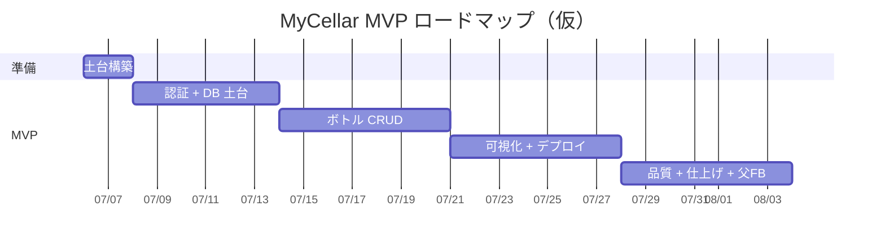

# MyCellar ロードマップ & マイルストーン

> 方針：計画は**週単位の粗さ**で持つ。アジャイルなのでズレたら調整する前提。日割りで縛らない。
> 確信度の勾配：**MVP（確定・日付あり）→ 次点（MVP 後・たぶん）→ アイスボックス（やるかも・未定）**。

---

## 全体像

- 想定期間：約 4 週間（＋準備）。休学中で 1 日 ~10h 確保できる前提。
- **時間が余るほど機能を盛らない**。余剰はバックエンド学習・テスト・仕上げ・ドキュメントに回す。
- **MVP（動く形）の目標：第 3 週末** ／ **ポートフォリオとして提出可能：第 4 週末**。
- 開始日（仮）：`2026-07-06`（月）。実際の開始日に合わせて各週の日付を調整する。

## マイルストーン（週次）

| 期間             | マイルストーン          | 主な作業                                                                                                                                                                                                                                                                 | 対応ストーリー |
| ---------------- | ----------------------- | ------------------------------------------------------------------------------------------------------------------------------------------------------------------------------------------------------------------------------------------------------------------------ | -------------- |
| Sprint 0（設計） | 計画が固まる            | 要件概要・ユーザーストーリー・データモデル・ロードマップ・ADR を Markdown で整備（＝本ドキュメント群）                                                                                                                                                                   | —              |
| 準備（〜2 日）   | 土台が立つ              | `create-next-app`（TS）／ESLint・Prettier・tsconfig strict／`.env.example` 作成／GitHub Issues・Projects 起票／Vercel・Neon 接続／Prisma 初期化                                                                                                                          | —              |
| 第 1 週          | 認証と DB の土台        | Prisma スキーマ（User・Bottle）＋マイグレーション／Better Auth で Google ログイン・ログアウト・保護ルート（セッション戦略・保護方式は現行の公式推奨を確認して決定）／空のボトル一覧ページ（プレースホルダ＝ログイン後の着地点）／「自分のデータだけ」の基盤              | US-1           |
| 第 2 週          | ボトル CRUD（芯の本体） | 登録フォーム（zod・必須は銘柄名）／一覧（モバイルファースト・空状態）／詳細／編集／削除（確認・所有権）／Route Handlers（書き込み）＋認可・読みは Server Component 直読み／**重要ロジック（zod・認可）の単体・結合テストを実装と併走**（→ `CONTRIBUTING.md` テスト方針） | US-2〜US-6     |
| 第 3 週          | 可視化 ＋ デプロイ      | ダッシュボード（国別の本数グラフ）／モバイル UI 調整／本番デプロイ（Vercel）・動作確認／README を実態に合わせて更新（デプロイ URL 反映）                                                                                                                                 | US-7           |
| 第 4 週          | 品質 ＋ 仕上げ ＋ 父 FB | **E2E（Playwright・主要フロー 1 本）＋ テストを細部まで拡充**＋ GitHub Actions（CI）※導入時に CLAUDE.md の Commands と PR テンプレへ test を追記／バグ修正・UI 磨き／README 充実（スクショ・デモ GIF）・アーキ図／**父に実際に使ってもらいフィードバック収集**／予備日   | 共通 DoD       |

> **MVP 完了の定義**：第 3 週末に「Google ログイン → ボトルを登録・一覧・編集・削除 → 傾向グラフ」が本番 URL で一通り動く。

> **Markdown → 実ツールへの反映（緩い指針）**：文書（README・ADR・要件・ストーリー・データモデル）はリポジトリ作成時に `docs/` へ置けば完了。計画系（ストーリー）は **実装直前** に GitHub Issues 化し Projects に並べる。これ以上は縛らない。

## 次点（MVP 後・たぶんやる）

優先順位順。**父のフィードバックを最有力の根拠にして着手を判断する**。

1. 写真アップロード（UploadThing もしくは Vercel Blob）
2. テイスティング記録（味の評価・レーダーチャート）
3. AI「今夜の 1 杯」提案（自分のボトルデータに基づく）
4. フィルタ・並べ替えの強化

> **開発インフラ（任意）**：ローカル DB を `docker-compose` でコンテナ化（本番＝Neon、ローカル＝コンテナ）。MVP には不要で、Docker 学習・環境分離の signal として芯の後に検討。デプロイの Docker 化はしない（Vercel 運用のため不要）。

## アイスボックス（やるかも・未定）

> 日付なし。やるとは限らない置き場。詳細は要件概要を参照。

ラベル写真から AI 自動入力 ／ 蒸留所の地図表示 ／ 歴史表示 ／ 実績バッジ ／ ウィッシュリスト ／ 読み取り専用の公開ページ ／ 店で出会ったウイスキーの地図記録

## 参考：ガント（仮・開始日に合わせて調整）

